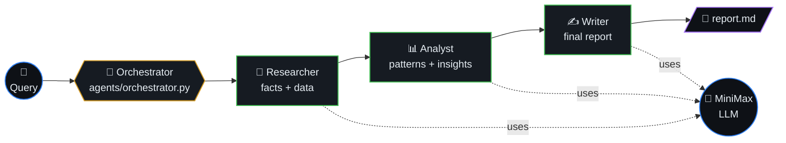

# MiniMax Agent Forge

A multi-agent AI research and content generation system powered by [MiniMax](https://www.minimaxi.com/) API. Orchestrates specialized agents — Researcher, Analyst, and Writer — to produce comprehensive reports on any topic.



## Table of contents

- [Architecture](#architecture)
- [Setup](#setup)
- [Usage](#usage)
- [Configuration](#configuration)
- [How it works](#how-it-works)
- [Project layout](#project-layout)
- [License](#license)

## Architecture

```
User Query
    │
    ▼
┌─────────────┐
│ Orchestrator │
└─────┬───────┘
      │
      ├──► Researcher Agent  → gathers key facts & data points
      ├──► Analyst Agent     → identifies patterns & insights
      └──► Writer Agent      → synthesizes into a polished report
```

Each agent has a distinct system prompt, specialized role, and communicates through a shared context pipeline.

## Setup

```bash
pip install -r requirements.txt
cp .env.example .env
# Add your MiniMax API key to .env
```

## Usage

```bash
# Run a research pipeline on any topic
python main.py "Impact of transformer architectures on edge AI deployment"

# Interactive mode
python main.py --interactive

# Save output to file
python main.py "Quantum computing in drug discovery" --output report.md
```

## Configuration

Set your MiniMax API key in `.env`:
```
MINIMAX_API_KEY=your-key-here
```

## How It Works

1. **Orchestrator** receives the user query and dispatches it to agents
2. **Researcher** breaks down the topic and generates structured research findings
3. **Analyst** reviews findings and extracts key insights, trends, and implications
4. **Writer** takes all context and produces a cohesive, well-structured report
5. Results are compiled and presented with rich terminal formatting

## Project layout

```
main.py                 # entrypoint
agents/
  base.py               # shared agent contract
  orchestrator.py       # dispatch + context pipeline
  researcher.py         # gather facts/data
  analyst.py            # extract patterns/insights
  writer.py             # synthesize the final report
pyproject.toml          # uv-managed deps
```

## License

MIT
